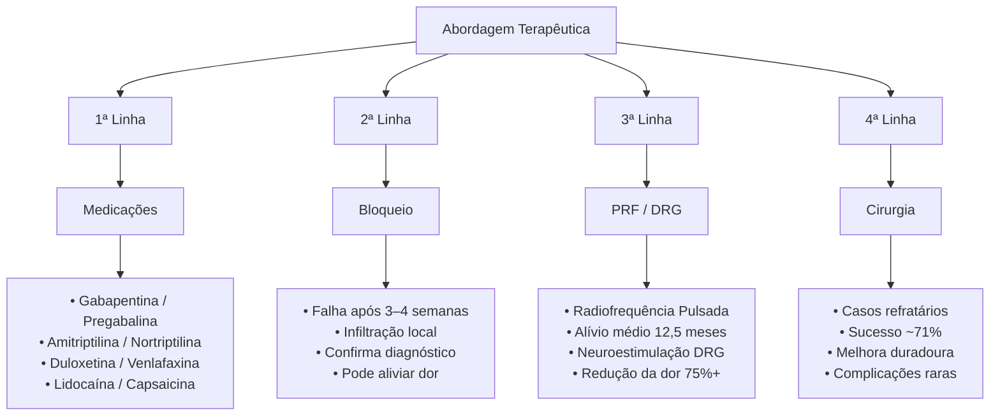

### Definição
Condição de dor neuropática crônica, causada por lesão, compressão ou aprisionamento dos nervos sensoriais da região inguinal - principalmente os nervos ilioinguinal, ílio-hipogástrico e ramo genital do nervo genitofemoral. É uma causa frequente de dor pós-operatória crônica após cirurgias abdominais baixas e pélvicas.

### Anatomia
Os três nervos principais são: 
- **Nervo ilioinguinal**: origina-se de L1, emerge na parede abdominal aproximadamente 3 cm medial e 3,7 cm inferior à espinha ilíaca ântero-superior, segue curso linear ao longo do canal inguinal paralelo ao ligamento inguinal, e termina cerca de 2,7 cm lateral à linha média e 1,7 cm acima da sínfise púbica 
- **Nervo ílio-hipogástrico**: também de L1, emerge cerca de 2,1 cm medial e 0,9 cm inferior à espinha ilíaca ântero-superior, posiciona-se cranialmente ao nervo ilioinguinal entre os músculos oblíquos interno e externo, e termina 3,7 cm lateral à linha média e 5,2 cm acima da sínfise púbica 
- **Nervo genitofemoral (ramo genital)**: origina-se de L1-L2, geralmente encontrado abaixo do cordão espermático junto aos vasos acompanhantes

![[Pasted image 20260419201058.png]]
A seguinte ilustração mostra a visão cirúrgica da região inguinal com a aponeurose do oblíquo externo parcialmente refletida, revelando os três nervos principais envolvidos na neuralgia inguinal:
- **Nervo ílio-hipogástrico**: localizado no plano entre as camadas do oblíquo externo e interno, posicionado cranialmente
- **Nervo ilioinguinal**: posicionado mais inferiormente, cursando ao longo da superfície ventral do canal inguinal, paralelo ao ligamento inguinal
- **Ramo genital do nervo genitofemoral**: localizado mais profundamente no campo cirúrgico, próximo ao anel inguinal interno e junto aos vasos espermáticos externos

### Mecanismo de lesão
#### Causas
A neuralgia inguinal é **predominantemente iatrogênica**, ocorrendo após: 
- <mark style="background:#fff88f">Cirurgias de hérnia inguina</mark>l (causa mais comum)
- Apendicectomia
- Cesárea e incisões de Pfannenstiel
- Histerectomia e cirurgias ginecológicas pélvicas
- Colecistectomia laparoscópica (lesão por trocater)
- Nefrectomia lombar

#### Mecanismos de lesão
1. **Trauma cirúrgico direto** (transecção ou lesão do nervo)
2. **Aprisionamento por sutura** durante fechamento das camadas abdominais
3. **Compressão por tecido cicatricial** ou fibrose perineural
4. **Lesão por estiramento** durante manipulação cirúrgica
5. **Compressão por tela cirúrgica** (meshoma) em reparos de hérnia
6. **Irritação mecânica** por fascia do oblíquo externo esgarçada ou assoalho do canal inguinal hipermóvel

### Clínica
A neuralgia inguinal apresenta características típicas de **dor neuropática**: 
- <mark style="background:#fff88f">Dor em queimação, formigamento ou choque elétrico</mark>
- <mark style="background:#fff88f">Alodínia</mark> (dor ao toque leve)
- <mark style="background:#fff88f">Hiperalgesia</mark> (resposta exagerada a estímulos dolorosos, incluindo ao frio)
- Parestesias e dormência
- Episódios paroxísticos de dor súbita e intensa
- Hipoestesia ou hiperestesia na distribuição dermatomal

A dor tipicamente localiza-se no abdome inferior, região inguinal, genitália e face medial superior da coxa, seguindo a distribuição dos nervos afetados.

#### Dor neuropática vs Nociceptiva
- **Dor neuropática**: queimação, formigamento, choque, dormência, hipersensibilidade

- **Dor nociceptiva**: dor surda, latejante, em peso; frequentemente associada a meshoma (massa palpável de tela cirúrgica) ou inflamação tecidual

### Diagnóstico
O diagnóstico é **clínico**, baseado em: 
1. **História cirúrgica** compatível (cirurgia abdominal baixa ou pélvica prévia)
2. **Características de dor neuropática** na distribuição dos nervos inguinais
3. **Exame físico**:
    - Palpação do ponto doloroso (tender point)
    - Mapeamento dermatomal para identificar qual(is) nervo(s) está(ão) envolvido(s)
    - Avaliação de alodínia e hiperalgesia
    - Exclusão de meshoma palpável ou recorrência de hérnia
4. **Bloqueio nervoso diagnóstico**: infiltração com anestésico local no ponto doloroso; **redução >50% da dor** confirma o diagnóstico de neuralgia inguinal 
5. **Exames de imagem**:
    - Ultrassonografia transvaginal/transabdominal para excluir patologia estrutural
    - TC ou RM para avaliar recorrência de hérnia, posição de tela, e patologias alternativas 
    - **Atrofia do gânglio da raiz dorsal L1** na RM pode ser um biomarcador diagnóstico (redução de 24% no volume ipsilateral em pacientes com CPIP)
6. **Biomarcadores séricos** (em investigação): elevação de CCL2 e BDNF, redução de ApoA1

>[!info] Anatomia ultrassonográfica
>![[Pasted image 20260419201158.png]]
>**Painel A**: Ilustração anatômica detalhada da parede abdominal anterior, mostrando as camadas musculares (oblíquo externo, oblíquo interno e transverso do abdome) e a localização dos nervos entre essas camadas
> **Painel B**: Esquema simplificado em corte transversal das mesmas camadas musculares
> **Painel C**: Imagem ultrassonográfica correspondente, demonstrando como os nervos ilioinguinal (II) e ílio-hipogástrico (IH) aparecem como **estruturas hipoecóicas entre os músculos oblíquo interno e transverso do abdome**

### Tratamento
A abordagem terapêutica segue um algoritmo escalonado (step-up approach).

## Resumo
| Aspecto                          | Detalhes                                                                                                                                                                                                                                                                                                                                               |
| -------------------------------- | ------------------------------------------------------------------------------------------------------------------------------------------------------------------------------------------------------------------------------------------------------------------------------------------------------------------------------------------------------ |
| **Definição**                    | Dor neuropática crônica por lesão, compressão ou aprisionamento dos nervos ilioinguinal, ílio-hipogástrico e/ou ramo genital do genitofemoral                                                                                                                                                                                                          |
| **Anatomia - Nervos Envolvidos** | • **Ilioinguinal** (L1): emerge 3 cm medial e 3,7 cm inferior à EIAS, cursa paralelo ao ligamento inguinal   • **Ílio-hipogástrico** (L1): emerge 2,1 cm medial e 0,9 cm inferior à EIAS, posiciona-se cranialmente ao ilioinguinal   • **Genitofemoral - ramo genital** (L1-L2): localizado junto aos vasos espermáticos                        |
| **Incidência**                   | • 12-62% após cirurgias inguinais   • 10-12% após herniorrafia (CPIP)   • 6-8% com dor clinicamente significativa   • 1,9% após cirurgias ginecológicas pélvicas maiores   • 8,5% desenvolvem dor nova após cirurgia de hérnia                                                                                                             |
| **Causas Cirúrgicas**            | • Herniorrafia inguinal (mais comum)   • Apendicectomia   • Cesárea/incisão de Pfannenstiel   • Histerectomia e cirurgias ginecológicas   • Colecistectomia laparoscópica   • Nefrectomia lombar   • Ooforoplastia                                                                                                                   |
| **Mecanismos de Lesão**          | • Trauma cirúrgico direto (transecção)   • Aprisionamento por sutura   • Compressão por tecido cicatricial/fibrose   • Lesão por estiramento   • Compressão por tela cirúrgica (meshoma)   • Irritação mecânica por fascia esgarçada                                                                                                    |
| **Características Clínicas**     | • Dor em queimação, formigamento ou choque elétrico   • Alodínia (dor ao toque leve)   • Hiperalgesia (incluindo ao frio)   • Parestesias e dormência   • Episódios paroxísticos de dor súbita   • Localização: abdome inferior, virilha, genitália, face medial da coxa                                                                |
| **Diagnóstico**                  | • **Clínico**: história + exame físico + características neuropáticas   • **Bloqueio diagnóstico**: >50% redução da dor confirma diagnóstico   • **Imagem**: USG/TC/RM para excluir outras causas   • **Biomarcador RM**: atrofia do gânglio L1 (redução 24% do volume)   • **Biomarcadores séricos** (investigação): ↑CCL2, ↑BDNF, ↓ApoA1 |
| **Diagnóstico Diferencial**      | • Recorrência de hérnia   • Meshoma   • Orquialgia   • Osteíte púbica   • Tendinopatia de adutores/reto abdominal   • Lesão muscular   • Patologia intra-abdominal ou urológica                                                                                                                                                      |
| **Tratamento - 1ª Linha**        | **Farmacológico (Nível A de evidência)**:   • Gabapentinoides (NNT 7,2-7,7)   • Antidepressivos tricíclicos (NNT 3,6)   • IRSN - duloxetina/venlafaxina (NNT 6,4)   • Tópicos: lidocaína (NNT 4,4) ou capsaicina                                                                                                                           |
| **Tratamento - 2ª Linha**        | **Bloqueios nervosos** (anestésico local + corticosteroide):   • Confirma diagnóstico (>50% redução)   • Alívio prolongado em 13-22%   • Teste preditivo para procedimentos invasivos                                                                                                                                                         |
| **Tratamento - 3ª Linha**        | **Procedimentos minimamente invasivos**:   • Radiofrequência pulsada: alívio médio 12,5 meses vs 1,6 meses (infiltrações)   • Neuroestimulação DRG: 75,5-76,8% redução da dor; 72,7-80% mantêm >50% melhora   • Eficácia até 92,8%                                                                                                            |
| **Tratamento - 4ª Linha**        | **Neurectomia cirúrgica**:   • Taxa de sucesso: 71% vs 22% (infiltrações repetidas)   • Melhora em 54-73% em longo prazo   • Redução mediana da dor: 60→14 (EVA)   • Complicações raras                                                                                                                                                    |
| **Prognóstico**                  | • 73% recuperação completa com tratamento adequado   • Tempo de resolução varia conforme gravidade   • Transecção não reparada: sintomas persistentes   • Uso crônico de opioides: preditor de mau resultado                                                                                                                                  |
| **Fatores de Risco**             | • Incisões 3 cm da EIAS (apendicectomia)   • Incisões 5 cm cranial ao ligamento inguinal (Pfannenstiel)   • Técnica cirúrgica inadequada   • Uso de tela com fixação   • Fatores psicossociais                                                                                                                                             |
