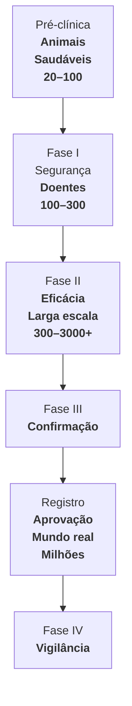

|               Fase                |                 Objetivo Principal                  |                   População                    |    Tamanho da Amostra    |     Duração     |                                    Desfechos Avaliados                                    |                                                  Características                                                   |
| :-------------------------------: | :-------------------------------------------------: | :--------------------------------------------: | :----------------------: | :-------------: | :---------------------------------------------------------------------------------------: | :----------------------------------------------------------------------------------------------------------------: |
|          **Pré-clínica**          |    Avaliar segurança e mecanismo de ação inicial    | Células  (in vitro) e animais  (in vivo) |      Não aplicável       |  Meses a anos   |                 Toxicidade, farmacocinética, eficácia em modelos animais                  |                       Obrigatória antes de testar em humanos; identifica dose inicial segura                       |
|            **Fase I**             | Avaliar segurança e tolerabilidade; determinar dose |       Voluntários saudáveis (geralmente)       |   20–100 participantes   | Semanas a meses | Efeitos adversos, dose máxima tolerada, farmacocinética (absorção, metabolismo, excreção) |                        Primeira vez em humanos; escalonamento de dose; não avalia eficácia                         |
|            **Fase II**            |     Avaliar eficácia preliminar e refinar dose      |          Pacientes com a doença-alvo           |  100–300 participantes   | Meses a 2 anos  |                     Eficácia inicial, efeitos adversos, dose-resposta                     |                   Estudo "prova de conceito"; pode ser IIa (exploratório) ou IIb (dose-resposta)                   |
|           **Fase III**            |   Confirmar eficácia e segurança em larga escala    |   Pacientes com a doença (população diversa)   | 300–3.000+ participantes |    1–4 anos     |                    Eficácia comparativa, segurança, qualidade de vida                     |         Randomizado, controlado, duplo-cego; compara com placebo ou tratamento padrão; base para registro          |
|     **Registro (ANVISA/FDA)**     |                Aprovação regulatória                |                       —                        |            —             |  Meses a anos   |                      Análise de todos os dados das fases anteriores                       |                   Submissão de dossiê; avaliação risco-benefício; aprovação para comercialização                   |
| **Fase IV (Pós-comercialização)** |          Monitorar segurança a longo prazo          |           População geral (uso real)           |    Milhares a milhões    | Contínuo (anos) |              Efeitos adversos raros, interações, efetividade no "mundo real"              | Farmacovigilância; pode detectar efeitos que não apareceram nas fases anteriores; pode levar à retirada do mercado |

|                  Pergunta comum                  |           Resposta            |
| :----------------------------------------------: | :---------------------------: |
|             Primeira vez em humanos?             |            Fase I             |
|    Avalia segurança em voluntários saudáveis?    |            Fase I             |
|         Primeira avaliação de eficácia?          |            Fase II            |
|   Estudo randomizado controlado para registro?   |           Fase III            |
|         Detecta efeitos adversos raros?          |            Fase IV            |
| Pode levar à retirada do medicamento do mercado? |            Fase IV            |
|   Qual fase tem maior número de participantes?   | Fase IV (pós-comercialização) |
|     Qual fase é obrigatória para aprovação?      |       Fases I, II e III       |
